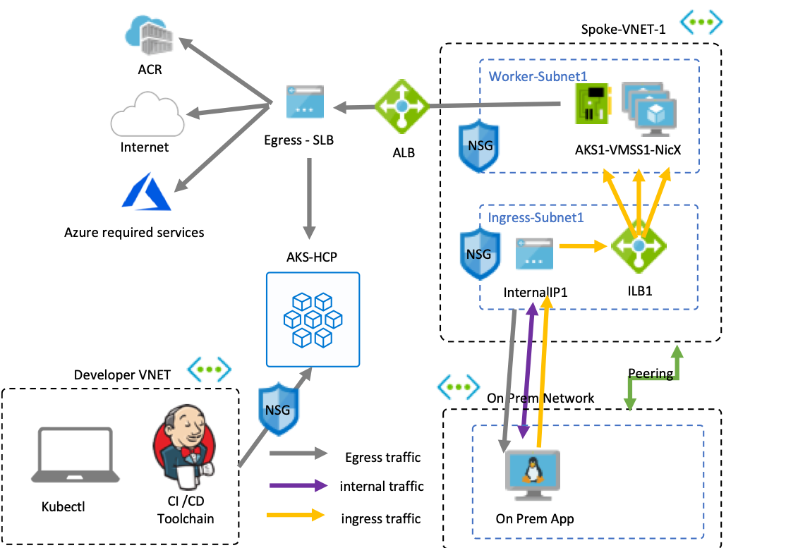
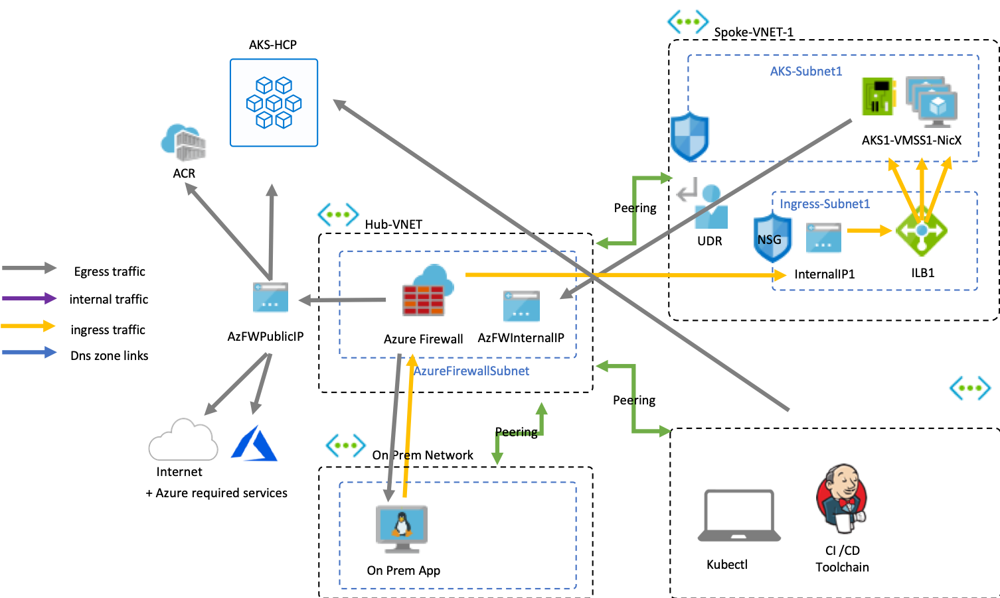
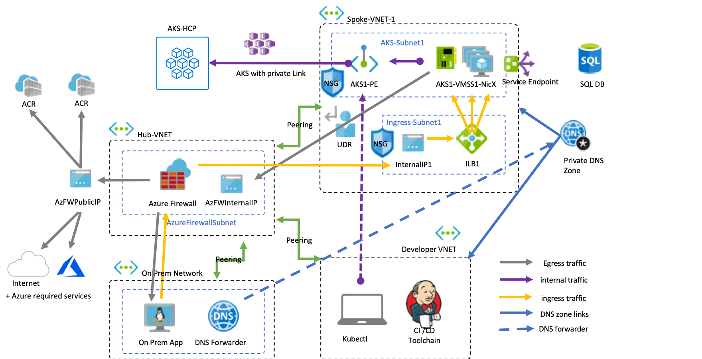
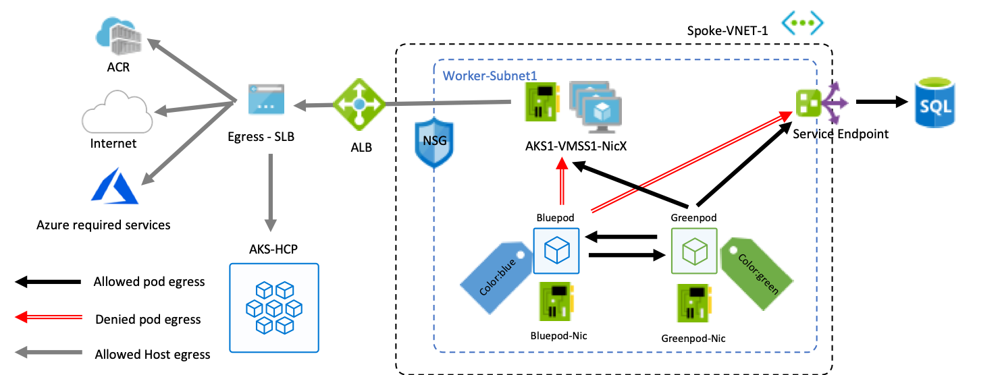

# Secure Network Design for AKS cluster

## Subnet Topology

Assumptions:
- We have internal peered networks that are not trustworthy
- We have no requirements for filtering egress traffic

The key design decisions for network topology are the following:
- How to preventing undesired acces to the AKS API Server through the internet 
- How to prevent SSH access to worker nodes from other internal networks
- How to define an internal ingress path to applications inside the cluster
- How to define an explicit egress path for worker nodes to the internet

Technologies used:
- Azure VNET
- Azure NSG
- AKS API Server Authorized IP Ranges
- Azure Standard Load Balancer Outbound rules

## Lockdown of Ingress Traffic

Assumptions:
- We have internal peered networks that are not trustworthy
- We have no requirements for filtering egress traffic
- We want to terminate SSL on the application gateway

Technologies used:
- Azure Application Gateway

## Lockdown of Egress Traffic

Assumptions:
- We want all egress traffic from host and pods to be subject to application and network level filtering 

For deploying a fully private cluster the following design decissions have to be made:
- How to ensure the reachability of required azure services from the Kubernetes infrastructure
- How to force and filter all egress traffic through a firewall appliance
- How to expose services 

Technologies used:
- Azure Firewall
- User Defined Routes
- Azure NSG

## AKS with Private Link

Assumptions:
- We do not want direct internet egress access for containerized applications
- We have on prem resources that should communicate with the containerized apps throught a private network
- We do not want to expose applications or control plane traffic to the internet

For deploying a fully private cluster the following design decissions have to be made:
- How to ensure the reachability of required azure services from the Kubernetes infrastructure
- How to force and filter all egress traffic through a firewall appliance
- How to ensure resolutions of private services through DNS

Technologies used:
- Azure firewall
- Azure private DNS Zone
- User Defined Routes

For more detailed documentation on how to set it up see here: https://docs.microsoft.com/en-gb/azure/aks/private-clusters

## Isolation of workloads inside the same cluster

Assumption:
- We are running multiple workloads in the same cluster and want to isolate them
- We want to control which pods can communicate inside the cluster
- We want to control which pods can communicate with which external azure services
- We do not want to block the host but the pods based on their labels

For deploying isolated pods the following design decissions have to be made:
- How do we want to define the network policy rules for internal communiation between pods
- How do we want to define the network policy for layer 7 rules to targets outside of the cluster

Technologies used:
- Calico Network policies
- Cillium Network policies